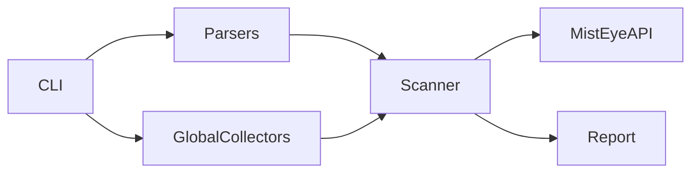

# MistEye DepScan

[English](README.md)

面向 [MistEye](https://app.misteye.io/api-docs) 威胁情报 API 的轻量 CLI，用于扫描项目依赖与全局已安装包中的已知恶意包及恶意版本。

## 功能特性

- 运行时依赖极少（Python 3.10+；在 3.10 上会自动安装 `tomli` 以解析 `pyproject.toml`）
- 三个子命令：`scan` / `global` / `check`
- 支持 Python 与 JS/TS 清单及锁文件；可选 Go / Rust / Ruby / .NET / Java
- 全局扫描：pip / npm（含 scoped 包 `@scope/pkg`）/ pnpm / nvm / pyenv / conda（部分为可选收集器）
- 输出格式：终端表格 / JSON / SARIF
- API 限流（10 次/秒）
- 扫描过程按包显示进度；可用 `-o` 保存完整报告

## 安装

```bash
git clone <your-repo-url>
cd MisteyeDepscan
python3 -m venv .venv
source .venv/bin/activate   # Windows: .venv\Scripts\activate
pip install -e .
depscan scan .
```

在虚拟环境中安装后，激活 venv 即可使用其 `bin` 目录下的 `depscan`（例如 `.venv/bin/depscan`）。

也可不依赖 `PATH` 中的 `depscan` 命令：

```bash
python -m misteye_depscan scan .
```

### 安装后找不到 `depscan`？

`pip install` 会生成 `depscan` 脚本，但具体路径取决于 Python 版本与操作系统，可能不在 `PATH` 中。若 pip 提示 `The script depscan is installed in '...' which is not on PATH`，可按提示使用对应路径，或查询用户脚本目录：

```bash
python3 -m site --user-base
# 可执行脚本通常在：<输出路径>/bin
```

若要在全局使用，将该 `bin` 目录加入 shell 配置（路径随 Python 版本变化，请勿写死 `3.10`）：

```bash
export PATH="$(python3 -m site --user-base)/bin:$PATH"
```

写入 `~/.zshrc` 或 `~/.bashrc` 后重新打开终端。开发场景仍推荐使用上面的 venv 方式。

> **说明**：`python3 -m site --user-base` 中的 `site` 是 Python 标准库模块名，用于查询「用户级安装」根目录，不是让你手动指定路径。

### `depscan` 命令定义在哪？

在 [`pyproject.toml`](pyproject.toml) 中注册：

```toml
[project.scripts]
depscan = "misteye_depscan.cli:main"
```

安装后会生成入口脚本，调用 [`src/misteye_depscan/cli.py`](src/misteye_depscan/cli.py) 中的 `main()`。模块方式入口：[`src/misteye_depscan/__main__.py`](src/misteye_depscan/__main__.py)。

## API Key

在 [app.misteye.io/api-keys](https://app.misteye.io/api-keys) 申请免费 API Key。

方式一：环境变量

```bash
export MISTEYE_API_KEY="your-api-key"
```

方式二：配置文件（权限须为 `600`）

```bash
mkdir -p ~/.config/misteye
printf '%s' "$MISTEYE_API_KEY" > ~/.config/misteye/api_key
chmod 600 ~/.config/misteye/api_key
```

首次在无 Key 的交互式终端中运行时会提示输入并保存。

## 用法

```bash
# 扫描当前项目
depscan scan .

# 扫描指定目录
depscan scan /path/to/project

# 扫描 Mac 系统级全局环境（默认）
# - Python：Homebrew /usr/local / 系统 Framework 路径（排除项目 .venv）
# - npm：全局安装根目录（npm root -g）
depscan global

# 额外扫描 pyenv / nvm / conda / pnpm-g 等（完整旧行为）
depscan global --all-envs

# 仅 Python 或仅 Node 全局环境
depscan global --python-only
depscan global --node-only

# 检查单个包
depscan check requests@2.32.3
depscan check lodash@4.17.21 --npm
depscan check requests==2.32.3 --pypi

# JSON / SARIF（适合 CI）
depscan scan . --json
depscan scan . --sarif
depscan global --json

# 将完整报告保存到文件
depscan scan . -o report.json
depscan global -o global-report.json
```

## 扫描结果与进度

每次扫描都会请求 MistEye API（不使用本地缓存），确保情报库更新后不会漏报。

### 进度输出

每完成一个包输出一行（并发扫描，顺序可能与依赖列表不一致）：

```text
[1/120] requests@2.32.3 → No threat record
[2/120] lodash@4.17.21 → No threat record
[3/120] evil-pkg@1.0.0 → Threat detected · critical
```

API 返回 `status: unknown` 时界面显示为 **No threat record**（绿色），而不是原始单词 `unknown`；这**不代表**该包一定安全。

保存完整报告：`depscan scan . -o report.json` 或 `depscan global -o global-report.json`。

静默模式：`--quiet`。关闭颜色：`depscan --no-color scan .` 或设置 `NO_COLOR=1`。

## 生态（自动检测）

与 MistEye 对齐：**npm** 与 **PyPI** 支持自动检测并扫描。

| 生态 | 标记文件 | 状态 |
|------|----------|------|
| **npm** | `package.json`、`package-lock.json`、`yarn.lock`、`pnpm-lock.yaml` | 已支持 |
| **PyPI** | `pyproject.toml`、`requirements*.txt`、`Pipfile`、`Pipfile.lock`、`poetry.lock`、`uv.lock`、`setup.py`、`setup.cfg` | 已支持 |

**自动检测规则**

- 在项目目录树中查找标记文件，跳过 `node_modules/`、`vendor/`、`.venv/`、`venv/`、`.tox/`、`site-packages/`、`dist/`、`build/` 等目录。
- 跳过上述目录仅影响**清单文件的发现位置**；**`node_modules/` 下已安装的包仍会扫描**（读取各包的 `package.json`）。

**手动指定生态**

```bash
depscan scan . --ecosystem=npm
depscan scan . --ecosystem=pypi
depscan scan . --ecosystem=all
depscan scan . --ecosystem=npm,pypi   # 省略时 = 自动检测

# 仅清单/锁文件（不扫描 node_modules 已安装树）
depscan scan . --no-node-modules
```

## 支持的依赖文件

**默认（npm + PyPI）**

- **PyPI**：`requirements*.txt`、`pyproject.toml`（PEP 621 + Poetry `[tool.poetry]`，含 `group.*.dependencies`）、`Pipfile`、`Pipfile.lock`、`poetry.lock`、`uv.lock`、`setup.py`、`setup.cfg`
- **npm**：`package.json`、`package-lock.json`、`pnpm-lock.yaml`、`yarn.lock`，以及 `node_modules/**/package.json`

**可选生态（默认关闭）**

- Go：`go.mod`、`go.sum`
- Rust：`Cargo.toml`、`Cargo.lock`
- Ruby：`Gemfile`、`Gemfile.lock`
- .NET：`*.csproj`、`packages.lock.json`
- Java：`pom.xml`、`build.gradle`、`build.gradle.kts`

```bash
depscan scan . --include-optional
depscan global --include-optional
```

## API 响应

MistEye Detect API 使用 `status` 字段（详见 [20260521-API更新对接.md](20260521-API更新对接.md)）：

```json
{ "status": "malicious", "matches": [...] }
{ "status": "unknown", "matches": [] }
```

| API `status` | 含义 |
|---|---|
| `malicious` | 命中已知威胁情报 |
| `unknown` | 库中无记录（界面显示 **No threat record**；**不**表示一定安全） |

**退出码**

| 代码 | 含义 |
|------|------|
| 0 | 扫描完成，未发现恶意包（含 `unknown` 结果） |
| 1 | 发现恶意包或恶意版本 |
| 2 | 扫描未完成（API/网络/覆盖率问题） |
| 3 | 配置错误（路径无效、缺少 API Key 等） |

调用 API 时：PyPI 使用 `name==version`；npm 使用 `name@version`。

## CI/CD 示例

GitHub Actions：

```yaml
name: depscan
on: [push, pull_request]

jobs:
  scan:
    runs-on: ubuntu-latest
    steps:
      - uses: actions/checkout@v4
      - uses: actions/setup-python@v5
        with:
          python-version: "3.12"
      - run: pip install -e .
      - run: depscan scan . --json
        env:
          MISTEYE_API_KEY: ${{ secrets.MISTEYE_API_KEY }}
```

## 开发

```bash
pip install -e ".[dev]"
pytest
```

## 架构



## 参考链接

- MistEye API 文档：https://app.misteye.io/api-docs
- MistEye API Key：https://app.misteye.io/api-keys
- MistEye Security Gate：https://github.com/slowmist/misteye-skills

## 许可证

MIT
