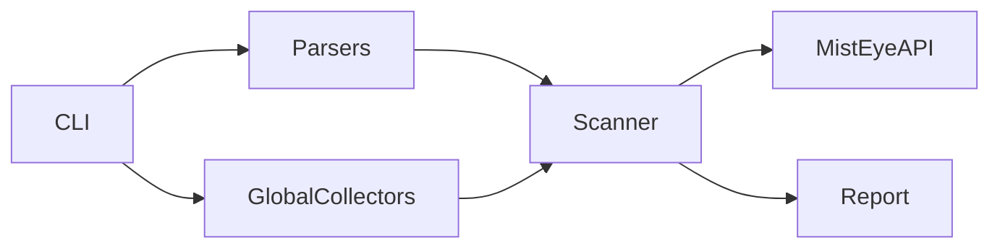

# MistEye DepScan

[中文版](README-CN.md) | [English](README.md)

A minimal-dependency CLI that calls the [MistEye](https://app.misteye.io/api-docs) threat intelligence API to scan project dependencies and globally installed packages for known malicious packages and versions.

## Features

- Minimal runtime dependencies (Python 3.10+; `tomli` is installed automatically on 3.10 for `pyproject.toml` parsing)
- Simple commands: `scan` / `global` / `check`
- Python and JS/TS manifest and lock files; optional Go / Rust / Ruby / .NET
- Global scanning for pip / npm (including scoped `@scope/pkg`) / pnpm / nvm / pyenv / conda (optional collectors)
- Output: terminal table / JSON / SARIF
- API rate limiting (10 req/s)
- Per-package progress during scans; save full reports with `-o`

## Installation

```bash
git clone <your-repo-url>
cd MisteyeDepscan
python3 -m venv .venv
source .venv/bin/activate   # Windows: .venv\Scripts\activate
pip install -e .
depscan scan .
```

After installing in a virtual environment, `depscan` is available in that environment’s `bin` directory (e.g. `.venv/bin/depscan`) while the venv is activated.

You can also run without relying on `depscan` on `PATH`:

```bash
python -m misteye_depscan scan .
```

### `depscan` not found after install?

`pip install` creates the `depscan` script, but the install location depends on your Python and OS and may not be on `PATH`. If pip prints `The script depscan is installed in '...' which is not on PATH`, use that path, or find the user scripts directory:

```bash
python3 -m site --user-base
# Scripts are usually at: <output>/bin
```

To use it globally, add that `bin` directory to your shell config (paths vary by Python version—do not hardcode `3.10`):

```bash
export PATH="$(python3 -m site --user-base)/bin:$PATH"
```

Add to `~/.zshrc` or `~/.bashrc` and open a new terminal. Using a venv (above) is still the most reliable approach for development.

### Where is the `depscan` command defined?

Registered in [`pyproject.toml`](pyproject.toml):

```toml
[project.scripts]
depscan = "misteye_depscan.cli:main"
```

Install generates a `depscan` entry point that calls `main()` in [`src/misteye_depscan/cli.py`](src/misteye_depscan/cli.py). Module entry: [`src/misteye_depscan/__main__.py`](src/misteye_depscan/__main__.py).

## API Key

Create a free API key at [app.misteye.io/api-keys](https://app.misteye.io/api-keys).

Either:

```bash
export MISTEYE_API_KEY="your-api-key"
```

Or save to a config file (must be mode `600`):

```bash
mkdir -p ~/.config/misteye
printf '%s' "$MISTEYE_API_KEY" > ~/.config/misteye/api_key
chmod 600 ~/.config/misteye/api_key
```

On first interactive run without a key, the tool prompts you to enter and save one.

## Usage

```bash
# Scan current project
depscan scan .

# Scan a specific project
depscan scan /path/to/project

# Scan Mac system-level global environments (default)
# - Python: Homebrew /usr/local / system Framework paths (excludes project .venv)
# - npm: global install root (npm root -g)
depscan global

# Also scan pyenv / nvm / conda / pnpm-g (legacy full behavior)
depscan global --all-envs

# Python or Node global only
depscan global --python-only
depscan global --node-only

# Check a single package
depscan check requests==2.32.3 --pypi
depscan check lodash@4.17.21 --npm

# JSON / SARIF (CI-friendly)
depscan scan . --json
depscan scan . --sarif
depscan global --json

# Save full report to a file
depscan scan . -o report.json
depscan global -o global-report.json

# Control scan depth (default: 10 levels)
depscan scan . --depth 20       # deeper
depscan scan . --depth 1        # only root level
depscan scan . --depth 0        # unlimited (full recursive)
```

## Scan results and progress

Every scan queries the MistEye API (no local result cache). This ensures newly discovered threats are never missed.

### Progress output

Each completed package prints one line (concurrent scan; order may differ from the dependency list):

```text
[1/120] requests==2.32.3 → No threat record
[2/120] lodash@4.17.21 → No threat record
[3/120] evil-pkg@1.0.0 → Threat detected · critical
```

API `status: unknown` is shown as **No threat record** (green), not the raw word `unknown`; this does **not** mean the package is guaranteed safe.

Save full report: `depscan scan . -o report.json` or `depscan global -o global-report.json`.

Quiet mode: `--quiet`. Disable colors: `depscan --no-color scan .` or `NO_COLOR=1`.

## Ecosystems (auto-detect)

Aligned with MistEye: **npm** and **PyPI** auto-detect and scan.

| Ecosystem | Marker files | Status |
|-----------|--------------|--------|
| **npm** | `package.json`, `package-lock.json`, `yarn.lock`, `pnpm-lock.yaml` | Supported |
| **PyPI** | `pyproject.toml`, `requirements*.txt`, `Pipfile`, `Pipfile.lock`, `poetry.lock`, `uv.lock`, `setup.py`, `setup.cfg` | Supported |

**Auto-detect rules**

- Finds marker files under the project tree, skipping `node_modules/`, `vendor/`, `.venv/`, `venv/`, `.tox/`, `site-packages/`, `dist/`, `build/`, etc.
- Skipping those dirs only affects **where manifests are discovered**; **installed packages under `node_modules/` are still scanned** (each package’s `package.json`).

**Override auto-detect**

```bash
depscan scan . --ecosystem=npm
depscan scan . --ecosystem=pypi
depscan scan . --ecosystem=all
depscan scan . --ecosystem=npm,pypi   # default when omitted = auto-detect

# Manifest/lock only (skip node_modules installed tree)
depscan scan . --no-node-modules
```

## Supported dependency files

**Default (npm + PyPI)**

- **PyPI**: `requirements*.txt`, `pyproject.toml` (PEP 621 + Poetry `[tool.poetry]` including `group.*.dependencies`), `Pipfile`, `Pipfile.lock`, `poetry.lock`, `uv.lock`, `setup.py`, `setup.cfg`
- **npm**: `package.json`, `package-lock.json`, `pnpm-lock.yaml`, `yarn.lock`, and `node_modules/**/package.json`

**Optional ecosystems (off by default)**

- Go: `go.mod`, `go.sum`
- Rust: `Cargo.toml`, `Cargo.lock`
- Ruby: `Gemfile`, `Gemfile.lock`
- .NET: `*.csproj`, `packages.lock.json`

> **Java / Maven is not supported.** The MistEye Detect API does not yet expose a `package:maven` type, so Java coordinates are intentionally not scanned to avoid false positives.

```bash
depscan scan . --include-optional
depscan global --include-optional
```

## API response

MistEye Detect API uses `status`:

```json
{ "status": "malicious", "matches": [...] }
{ "status": "unknown", "matches": [] }
```

| API `status` | Meaning |
|---|---|
| `malicious` | Matched known threat intelligence |
| `unknown` | No match in the database (shown as **No threat record**; **not** guaranteed safe) |

**Exit codes**

| Code | Meaning |
|------|---------|
| 0 | Scan finished; no malicious packages (includes `unknown` items) |
| 1 | Malicious package or version found |
| 2 | Incomplete scan (API/network/coverage) |
| 3 | Configuration error (bad path, missing API key) |

PyPI uses `name==version`; npm and other ecosystems use `name@version` for both display and API requests. Cross-ecosystem matches (e.g. an npm-only threat indicator returned for a PyPI scan) are ignored to avoid false positives caused by same-name packages across ecosystems.

## CI/CD example

GitHub Actions:

```yaml
name: depscan
on: [push, pull_request]

jobs:
  scan:
    runs-on: ubuntu-latest
    steps:
      - uses: actions/checkout@v4
      - uses: actions/setup-python@v5
        with:
          python-version: "3.12"
      - run: pip install -e .
      - run: depscan scan . --json
        env:
          MISTEYE_API_KEY: ${{ secrets.MISTEYE_API_KEY }}
```

## Development

```bash
pip install -e ".[dev]"
pytest
```

## Architecture



## References

- MistEye API docs: https://app.misteye.io/api-docs
- MistEye API keys: https://app.misteye.io/api-keys
- MistEye Security Gate: https://github.com/slowmist/misteye-skills

## License

MIT
